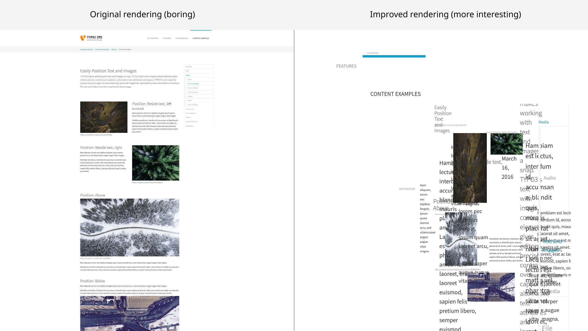

.. ==================================================
.. FOR YOUR INFORMATION
.. --------------------------------------------------
.. -*- coding: utf-8 -*- with BOM.

.. include:: ../Includes.txt

Introduction
============

What does it do?
----------------

The goal of this extension is to improve the frontend user experience by 156 % (estimated).

All this is available without any configuration! Just install the extension (see :ref:`admin-manual`).
The magic happens on every page reload!

The high quality result could be achieved by implementing pure magic.

If you liked this extension you might like `Type-o-Carson-o-matic <https://extensions.typo3.org/extension/carson>`_ too.

FAQ
---

:Question: When should I use this extension?
:Answer: Always! Especially when you want to make your coworker happy.

Screenshots
-----------

